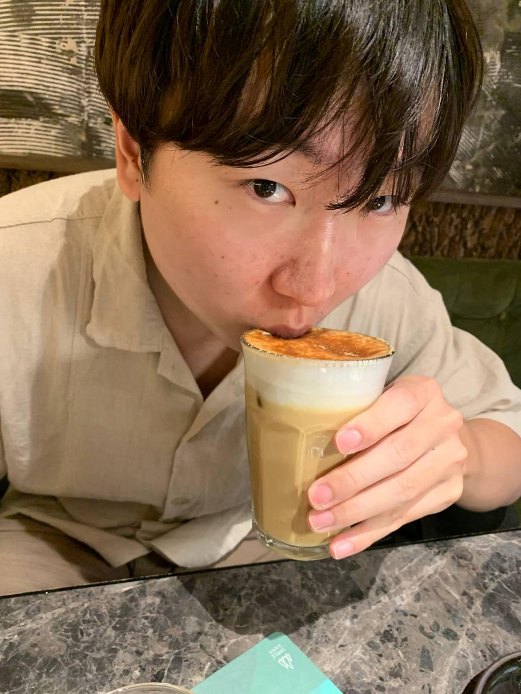
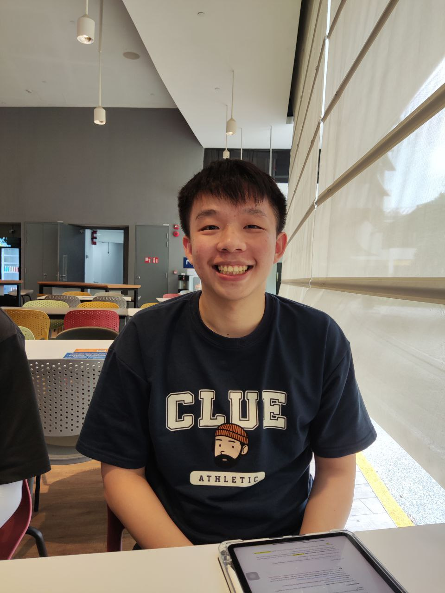

# About Us

We are a team based in the [School of Computing, National University of Singapore](http://www.comp.nus.edu.sg).

You can reach us at the email `seer[at]comp.nus.edu.sg`

## Project team

### Lim Shao Qi

[[github](https://github.com/limshaoqi)]

* Role: Gangster skrtttt
* Responsibilities: Motivating the Team and Time Keeper

### Sue Zheng Long

[[github](http://github.com/zhenglong1603)]

* Role: Documentation
* Responsibilities: Writing Clear and Concise Documentation

### Mervyn Teo

[[github](http://github.com/mervyn-teo)]
[[portfolio](team/mervyn-teo.md)]

* Role: IntelliJ expert
* Responsibilities: Backend

### Pun Yik Hong

[[github](http://github.com/awlarpi)]

* Role: Testing
* Responsibilities: Unit Testing + System Testing

### Dang Hoang Duy

[[github](https://github.com/DiligentPenguinn)]
[[linkedIn](https://www.linkedin.com/in/dang-hoang-duy-0485b025b/)]

* Role: Member
* Responsibility: Code

