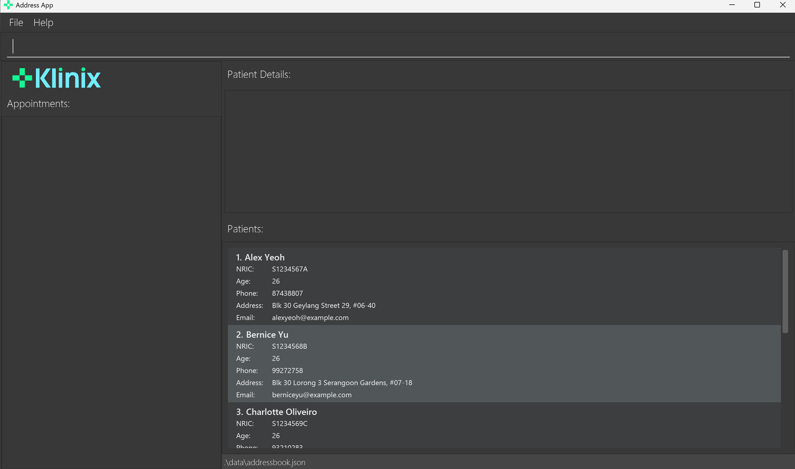

# Klinix User Guide

Klinix Level 3  is a **desktop app for managing contacts, optimized for use via a  Line Interface** (CLI) while still having the benefits of a Graphical User Interface (GUI). If you can type fast, you can get your contact management tasks done faster than traditional GUI apps.

<!-- * Table of Contents -->
<page-nav-print />

--------------------------------------------------------------------------------------------------------------------

## Quick start

1. Ensure you have Java `17` or above installed in your Computer. 
   **Mac users:** Ensure you have the precise JDK version prescribed [here](https://se-education.org/guides/tutorials/javaInstallationMac.html).

1. Download the latest `.jar` file from [here](https://github.com/se-edu/Klinix-level3/releases).

1. Copy the file to the folder you want to use as the _home folder_ for your Klinix.

1. Open a command terminal, `cd` into the folder you put the jar file in, and use the `java -jar Klinix.jar` command to run the application. 
   A GUI similar to the below should appear in a few seconds. Note how the app contains some sample data. 
   

1. Type the command in the command box and press Enter to execute it. e.g. typing **`help`** and pressing Enter will open the help window. 
   Some example commands you can try:

   * `list` : Lists all contacts.

   * `add ` : Adds a contact to Klinix.

   * `delete 3` : Deletes the 3rd contact shown in the current list.

   * `clear` : Deletes all contacts.

   * `exit` : Exits the app.

1. Refer to the [Features](#features) below for details of each command.

--------------------------------------------------------------------------------------------------------------------

## Features

<box type="info" seamless>

**Notes about the command format:** 

* Words in `UPPER_CASE` are the parameters to be supplied by the user. 
  e.g. in `add n/NAME`, `NAME` is a parameter which can be used as `add n/John Doe`.

* Items in square brackets are optional. 
  e.g `n/NAME [t/TAG]` can be used as `n/John Doe t/friend` or as `n/John Doe`.

* Items with `…`​ after them can be used multiple times including zero times. 
  e.g. `[t/TAG]…​` can be used as ` ` (i.e. 0 times), `t/friend`, `t/friend t/family` etc.

* Parameters can be in any order. 
  e.g. if the command specifies `n/NAME p/PHONE_NUMBER`, `p/PHONE_NUMBER n/NAME` is also acceptable.

* Extraneous parameters for commands that do not take in parameters (such as `help`, `list`, `exit` and `clear`) will be ignored. 
  e.g. if the command specifies `help 123`, it will be interpreted as `help`.

* If you are using a PDF version of this document, be careful when copying and pasting commands that span multiple lines as space characters surrounding line-breaks may be omitted when copied over to the application.
</box>

### Viewing past commands:

You can scroll through your previously entered commands using the **Up** and **Down** arrow keys.

- **Up Arrow**: Scrolls to the previous command in the history.
- **Down Arrow**: Scrolls to the next command in the history.

This feature allows you to quickly reuse or edit previously entered commands without retyping them.

#### Example Usage:

1. Enter a command, such as `list`, and press Enter.
2. Press the **Up Arrow** key to bring up the `list` command in the command box.
3. Press the **Down Arrow** key to navigate back to a more recent command.

#### Notes:

- The command history is saved only for the current session and will reset when the application is restarted.

### Viewing help : `help`

Shows a message explaning how to access the help page.

Format: `help`

### Adding a person: `add`

Adds a person to the address book.

Format: `add n/NAME p/PHONE_NUMBER e/EMAIL ic/NRIC b/BIRTHDATE a/ADDRESS [t/TAG]…​`

<box type="tip" seamless>

**Tip:** A person can have any number of tags (including 0)
</box>

Examples:
* `add n/John Doe p/98765432 e/johnd@example.com ic/S0123456A b/10/10/2000 a/John street, block 123, #01-01`
* `add n/Betsy Crowe t/friend e/betsycrowe@example.com ic/S9876543B b/01/01/1990 a/Newgate Prison p/1234567 t/criminal`

### Listing all persons : `list`

Shows a list of all persons in the address book.

Format: `list`

### Editing a person : `edit`

Edits an existing person in the address book.

Format: `edit INDEX [n/NAME] [p/PHONE] [e/EMAIL] [ic/NRIC] [b/BIRTHDATE] [a/ADDRESS] [t/TAG]..​`

parameters:
* `INDEX`: The index of the person in the displayed list. It must be a positive integer.
* `NAME`: (Optional) The name of the person. It should not be blank.
* `PHONE`: (Optional) The phone number of the person. It should be a valid phone number.
* `EMAIL`: (Optional) The email of the person. It should be a valid email address.
* `NRIC`: (Optional) The NRIC of the person. It should be a valid NRIC number.
* `BIRTHDATE`: (Optional) The birthdate of the person. It should be a valid date in the format `dd/MM/yyyy`.
* `ADDRESS`: (Optional) The address of the person. It should not be blank.
* `TAG`: (Optional) The tag of the person.

* Edits the person at the specified `INDEX`. The index refers to the index number shown in the displayed person list. The index **must be a positive integer** 1, 2, 3, …​
* At least one of the optional fields must be provided.
* Existing values will be updated to the input values.
* When editing tags, the existing tags of the person will be removed i.e adding of tags is not cumulative.
* You can remove all the person’s tags by typing `t/` without
    specifying any tags after it.

Examples:
*  `edit 1 p/91234567 e/johndoe@example.com` Edits the phone number and email address of the 1st person to be `91234567` and `johndoe@example.com` respectively.
*  `edit 2 n/Betsy Crower t/` Edits the name of the 2nd person to be `Betsy Crower` and clears all existing tags.

### Locating persons by name: `find`

Finds persons whose names contain any of the given keywords.

Format: `find KEYWORD [MORE_KEYWORDS]`

* The search is case-insensitive. e.g `hans` will match `Hans`
* The order of the keywords does not matter. e.g. `Hans Bo` will match `Bo Hans`
* Only the name is searched.
* Only full words will be matched e.g. `Han` will not match `Hans`
* Persons matching at least one keyword will be returned (i.e. `OR` search).
  e.g. `Hans Bo` will return `Hans Gruber`, `Bo Yang`

Examples:
* `find John` returns `john` and `John Doe`
* `find alex david` returns `Alex Yeoh`, `David Li` 
  

### Deleting a person : `delete`

Deletes the specified person from the address book.

Format: `delete INDEX`

* Deletes the person at the specified `INDEX`.
* The index refers to the index number shown in the displayed person list.
* The index **must be a positive integer** 1, 2, 3, …​

Examples:
* `list` followed by `delete 2` deletes the 2nd person in the address book.
* `find Betsy` followed by `delete 1` deletes the 1st person in the results of the `find` command.

### Clearing all entries : `clear`

Clears all entries from the clinic.

Format: `clear`

### Add medical report: `addmr`

Add a new medical report to a patient's record.

Format: `addmr ic/NRIC al/ALLERGIES ill/ILLNESSES sur/SURGERIES imm/IMMUNIZATIONS`

parameters:
- `NRIC`: The NRIC of the patient. It must be a valid NRIC number.
- `ALLERGIES`: The allergies of the patient. It can be `None` or a list of allergies separated by spaces.
- `ILLNESSES`: The illnesses of the patient. It can be `None` or a list of illnesses separated by spaces.
- `SURGERIES`: The surgeries of the patient. It can be `None` or a list of surgeries separated by spaces.
- `IMMUNIZATIONS`: The immunizations of the patient. It can be `None` or a list of immunizations separated by spaces.

Examples:
* `addmr ic/S1234567A al/Penicillin ill/Flu sur/Appendectomy imm/Flu Vaccine`
* `addmr ic/T0260144G al/None ill/None sur/None imm/None`

**Warning:**

1. The patient with the given NRIC must exist, otherwise Klinix will show an error message.
2. If the patient already has a medical report, adding a new one will overwrite the existing one.

### Delete medical report: `deletemr`

Delete a patient's existing medical report.

Format: `deletemr ic/NRIC`

Parameters:
- `NRIC`: The NRIC of the patient. It must be a valid NRIC number.

Examples:
* `deletemr ic/S1234567A`
* `deletemr ic/T0260144G`

**Warning**

1. The patient with the given NRIC must exist, otherwise Klinix will show an error message.
2. If the patient does not have an existing medical report, nothing will happen.

### Add medicine usage records: `addmu`

Add a new medicine usage record as part of a patient’s medical history or medical needs.

Format: `addmu ic/NRIC n/MEDICINE_NAME dos/DOSAGE from/START to/END`

Parameters:
- `NRIC`: The NRIC of the patient. It must be a valid NRIC number.
- `MEDICINE_NAME`: The name of the medicine. It should not be blank.
- `DOSAGE`: The dosage of the medicine. It should not be blank.
- `START`: The start date of the medicine usage. It must be in the format `dd-MM-yyyy`.
- `END`: The end date of the medicine usage. It must be in the format `dd-MM-yyyy`.

Examples:
* `addmu ic/T0260144G n/Paracetamol dos/Two 500mg tablets, 4 times in 24 hours from/23-02-2025 to/25-02-2025`
* `addmu ic/S1234567A n/Panadol Extra dos/Two 250mg tablets, once per day from/01-03-2025 to/05-03-2025`

**Warning:**

1. `START` and `END`must be in the format of `dd-MM-yyyy`
2. The patient with the given NRIC must exist, otherwise Klinix will show an error message.
2. Two medicine usage records from the same patient are overlapped if they have the same name and overlapping duration.
Klinix will detect such overlapping instances and give an error message when you try to add them.

### Clear all medicine usage records: `clearmu`

Clear all medicine usage records of a patient's medical history.

Format: `clearmu ic/NRIC`

Examples: `clearmu ic/S1234567A`

**Warning:**

1. The patient with the given NRIC must exist, otherwise Klinix will show an error message.

### Delete medicine usage records: `deletemu`

Delete a particular medicine usage record of a patient's medical history.

Format: `deletemu INDEX ic/NRIC`

Parameters:
- `INDEX`: The index of the medicine usage record in the displayed list. It must be a positive integer.
- `NRIC`: The NRIC of the patient. It must be a valid NRIC number.

Examples:
* `deletemu 2 ic/S1234567A`

### Add appointment: `addappt`

Add a new appointment to the patient.

Format: `addappt ic/NRIC dic/DOCTOR_NRIC appt/DESCRIPTION from/START to/END`

Example:
* `addappt ic/S1234567A dic/S9876543A appt/Check-up from/22-02-2025 10:00 to/23-02-2025 10:15`

**Warning:**

1. `START` and `END`must be in the format of `dd-MM-yyyy HH:mm`
2. The patient with the given NRIC must exist, otherwise Klinix will show an error message.
2. Two appointments from the same patient are overlapped if they have the same name and overlapping duration.
   Klinix will detect such overlapping instances and give an error message when you try to add them.

### Delete appointment: `deleteappt`

Delete the specified appointment from the patient.

Format: `deleteappt INDEX ic/NRIC`

Parameters:
- `INDEX`: The index of the appointment in the displayed list. It must be a positive integer.
- `NRIC`: The NRIC of the patient. It must be a valid NRIC number.

Example:
* `deleteappt 2 ic/S1234567A`

**Warning:**

1. The patient with the given NRIC must exist, otherwise Klinix will show an error message.
2. The index given must also be valid, a positive integer and within the appointment list size.

### Clear all appointment records: `clearappt`

Clear all appointments of a patient.

Format: `clearappt ic/<NRIC>`

Parameters:
- `NRIC`: The NRIC of the patient. It must be a valid NRIC number.

Examples: `clearappt ic/S1234567A`

**Warning:**

1. The patient with the given NRIC must exist, otherwise Klinix will show an error message.

### View appointments on specific date: `appton`

Display all appointments on a specific date.

Format: `appton date/DATE`

Parameters:
- `DATE`: The date to view appointments on. It must be in the format `dd-MM-yyyy`.

Examples: `appton date/22-03-2025`

### Exiting the program : `exit`

Exits the program.

Format: `exit`

### Saving the data

Klinix data are saved in the hard disk automatically after any command that changes the data. There is no need to save manually.

### Editing the data file

Klinix data are saved automatically as a JSON file `[JAR file location]/data/Klinix.json`. Advanced users are welcome to update data directly by editing that data file.

**Caution:**
If your changes to the data file makes its format invalid, Klinix will discard all data and start with an empty data file at the next run.  Hence, it is recommended to take a backup of the file before editing it. 
Furthermore, certain edits can cause the Klinix to behave in unexpected ways (e.g., if a value entered is outside the acceptable range). Therefore, edit the data file only if you are confident that you can update it correctly.
</box>

--------------------------------------------------------------------------------------------------------------------

## FAQ

**Q**: How do I transfer my data to another Computer? 
**A**: Install Klinix in the other computer and overwrite its data file with the old data file from your previous Klinix home folder.
**Q**: How to edit an appointment since there is no command for it 
**A**: We suggest deleting the existing appointment with `deleteappt` command first before using `addappt` command to create a new appointment with the edited details.

--------------------------------------------------------------------------------------------------------------------

## Known issues

1. **When using multiple screens**, if you move the application to a secondary screen, and later switch to using only the primary screen, the GUI will open off-screen. The remedy is to delete the `preferences.json` file created by the application before running the application again.
2. **If you minimize the Help Window** and then run the `help` command (or use the `Help` menu, or the keyboard shortcut `F1`) again, the original Help Window will remain minimized, and no new Help Window will appear. The remedy is to manually restore the minimized Help Window.

--------------------------------------------------------------------------------------------------------------------

## Command summary

Action     | Format, Examples
-----------|----------------------------------------------------------------------------------------------------------------------------------------------------------------------
**Add**    | `add n/NAME p/PHONE_NUMBER ic/NRIC e/EMAIL a/ADDRESS [t/TAG]…​`   e.g., `add n/James Ho p/22224444 e/jamesho@example.com a/123, Clementi Rd, 1234665 t/friend t/colleague`
**Add Appointment** | `addappt ic/NRIC dic/DOCTOR_NRICE appt/DESCRIPTION from/START to/END`   e.g., `addappt ic/T0260144G dic/T9876543B appt/Check-Up from/22-02-2025 10:00 to/23-02-2025 10:15`
**Add Medical Report** | `addmr ic/NRIC al/ALLERGIES ill/ILLNESSES sur/SURGERIES imm/IMMUNIZATIONS`   e.g., `addmr ic/S1234567A al/Penicillin ill/Flu sur/Appendectomy imm/Flu Vaccine`
**Add Medicine Usage** | `addmu ic/NRIC n/MEDICINE_NAME dos/DOSAGE from/START to/END`   e.g., `addmu ic/T0260144G n/Paracetamol dos/Two 500mg tablets, 4 times in 24 hours from/23-02-2025 to/25-02-2025`
**Clear**  | `clear`
**Clear Appointments** | `clearappt ic/NRIC`   e.g., `clearappt ic/S1234567A`
**Clear Medicine Usage** | `clearmu ic/NRIC`   e.g., `clearmu ic/S1234567A`
**Delete** | `delete INDEX`  e.g., `delete 3`
**Delete Appointment** | `deleteappt INDEX ic/NRIC`   e.g., `deleteappt 3 ic/S1234567A`
**Delete Medical Report** | `deletemr ic/NRIC`   e.g., `deletemr ic/S1234567B`
**Edit**   | `edit INDEX [n/NAME] [p/PHONE_NUMBER] [ic/NRIC] [e/EMAIL] [a/ADDRESS] [t/TAG]…​`  e.g.,`edit 2 n/James Lee e/jameslee@example.com`
**Exit**   | `exit`
**Find**   | `find KEYWORD [MORE_KEYWORDS]`  e.g., `find James Jake`
**Find Medicine Usage** | `findmu ic/NRIC`  e.g., `findmu ic/S1234567A`
**Mark Appointment** | `markappt INDEX ic/NRIC`  e.g., `markappt 2 ic/S1234567A`
**Help**   | `help`
**List**   | `list`
**Unmark Appointment** | `unmarkappt INDEX ic/NRIC`  e.g., `unmarkappt 2 ic/S1234567A`
**View Appointment on specific date** | `appton date/DATE`   e.g., `appton date/22-03-2025`
