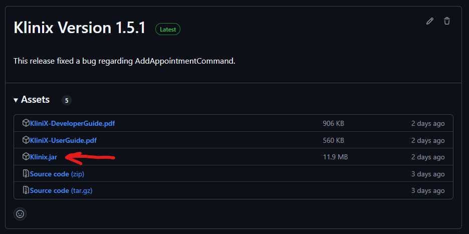
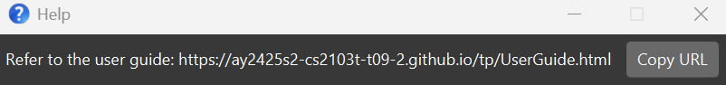
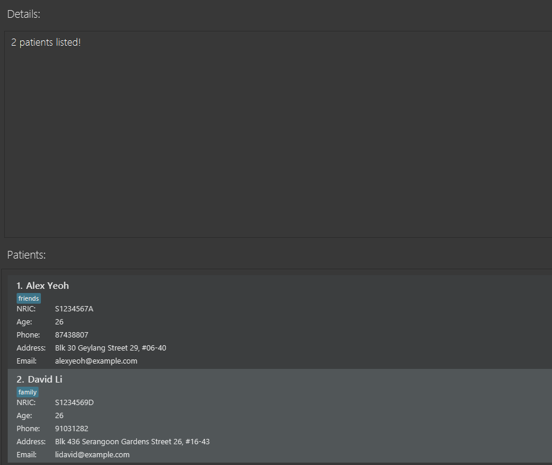

# **Klinix User Guide**

Klinix is a desktop app targeted towards **general practitioners (GPs)** to make their daily patient management faster and easier. 

Klinix serves as a digital bridge for general practitioners in smaller clinics, streamlining their administrative tasks with a focus on patient management and tracking patient visit and medical histories.<br>

Klinix combines the speed of typing commands with a simple, user-friendly interface, so that they can quickly find and update patient information without a hassle.

**Because the smoother your workflow, the better care you can provide.**

<!-- * Table of Contents -->

# Table of Contents
1. [Quick Start](#quick-start)
2. [Input Parameters](#input-parameters)
3. [Features](#features)
    - **General Commands**
        - [Viewing patient details](#viewing-patient-details)
        - [Viewing past commands](#viewing-past-commands)
        - [Viewing help](#viewing-help-help)
        - [Clearing all patient entries](#clearing-all-patient-entries-clear)
        - [Exiting the program](#exiting-the-program-exit)
        - [Saving the data](#saving-the-data)
        - [Editing the data file](#editing-the-data-file)
    - **Patient Management**
        - [Adding a patient](#adding-a-patient-add)
        - [Deleting a patient](#deleting-a-patient-delete)
        - [Editing a patient](#editing-a-patient-edit)
        - [Listing all patients](#listing-all-patients-list)
        - [Finding patients by keywords](#finding-patients-by-keywords-find)
    - **Medical Report Management**
        - [Adding a medical report to a patient](#adding-a-medical-report-addmr)
        - [Deleting a medical report from a patient](#deleting-a-medical-report-deletemr)
    - **Medicine Usage Management**
        - [Adding a medicine usage record to a patient](#adding-a-medicine-usage-record-addmu)
        - [Deleting a medicine usage record from a patient](#deleting-a-medicine-usage-record-deletemu)
        - [Clearing all medicine usage records from a patient](#clearing-all-medicine-usage-records-clearmu)
        - [Finding medicine usage records by medicine names](#finding-medicine-usages-by-medicine-names-findmu)
    - **Appointment Management**
        - [Adding an appointment to a patient](#adding-an-appointment-addappt)
        - [Deleting an appointment from a patient](#deleting-an-appointment-deleteappt)
        - [Clearing list of appointments from a patient](#clearing-all-appointment-records-clearappt)
        - [Marking appointment as visited](#marking-an-appointment-markappt)
        - [Unmarking appointment as not visited](#unmarking-an-appointment-unmarkappt)
        - [Viewing appointments that start on specific date](#viewing-appointments-on-specific-date-appton)
4. [FAQ](#faq)
5. [Glossary](#glossary)
6. [Known Issues](#known-issues)
7. [Command Summary](#command-summary)
---
<div style="page-break-after: always;"> </div>

# Quick Start

1. **Install Java:**
   Ensure you have Java `17` or above installed on your computer.
   - **Windows & Linux Users:** Download and install Java from [Oracle JDK 17 Archive Downloads](https://www.oracle.com/java/technologies/javase/jdk17-archive-downloads.html).
     - **Windows Users:** Follow the instructions [here](https://se-education.org/guides/tutorials/javaInstallationWindows.html).
     - **Linux Users:** Follow the instructions [here](https://se-education.org/guides/tutorials/javaInstallationLinux.html).
   - **Mac Users:** Install the precise JDK version prescribed [here](https://se-education.org/guides/tutorials/javaInstallationMac.html).

2. **Download the Application:**
   Get the latest `.jar` file from [this release page](https://github.com/AY2425S2-CS2103T-T09-2/tp/releases).
   Version names may vary, but the file name should be `Klinix.jar`.


3. **Prepare Your Folder:**
   Create an empty folder that will serve as your _home folder_ for Klinix, and copy the downloaded `.jar` file into that folder.
    - **Windows:** Create a folder named `Klinix` on your Desktop.
    - **macOS/Linux:** Create a folder named `Klinix` in your home directory.

        or
      
    - **macOS/Linux:** You can create the folder using the command:
      ```bash
      mkdir ~/Klinix
      ```

4. **Run the Application:**
   - Open a command terminal.
   - Navigate to the folder where you copied the `.jar` file:
     - **Windows:** Open Command Prompt, type `cd ` followed by the folder path, then press Enter.
     - **macOS/Linux:** Open Terminal, type `cd ` followed by the folder path, then press Enter.
   - Run the application by entering the following command:
     ```
     java -jar Klinix.jar
     ```
     After a few seconds, a GUI will appear. Note that when you first start the app, there will be sample data. You may wish to clear the sample data using the `clear` command.


5. **Using the Application:**
   - Type a command in the command box and press Enter to execute it. For example, typing **`help`** and pressing Enter will open the help window.
   - Here are some example commands you can try:
     - `list` : Lists all patients.
     - `add n/John Doe p/8888888 e/JohnDoe@student.comp.nus.edu.com.sg b/01-01-1990 a/Newgate Prison p/1234567 t/criminal` : Adds a new patient to Klinix.
     - `delete 3` : Deletes the 3rd patient shown in the current list.
     - `clear` : Deletes all patients.
     - `exit` : Exits the app.

6. **More Information:**
   Refer to the [Features](#features) section below for detailed descriptions of each command.

[Back to Table of Contents](#table-of-contents)

--------------------------------------------------------------------------------------------------------------------
# Input parameters

<box type="info" seamless>

**Notes about parameters:**<br>

- Parameters will be in the form of `p/[PARAMETER]` where p is the parameter symbol. For example, the command `add n/John`<br>
  - `n/` is the parameter symbol<br>
  - `John` is the parameter
- All arguments are trimmed before processing:
  - Arguments of prefixes `ic/`, `b/`, `p/`, `e/`, `from/`, `to/`, `/date` are trimmed by removing **ALL WHITE SPACES**
  - Arguments of remaining prefixes are trimmed following the [Trimming Rules](#input-trimming-rules) below.
    </box>

**NRIC Consistency**: <br>
All NRIC fields (`ic`) follow the same 9-character alphanumeric rule.<br>

**Date Formats**:<br>
    - `dd-MM-yyyy` for birthdates and medicine dates.<br>
    - `dd-MM-yyyy HH:mm` for appointments.

**Error Handling**: Refer to the messages prompted when invalid parameters are entered (e.g. "Invalid NRIC format").
  
</box>

---

### **Patient Parameters**

| Symbol  | Parameter       | Constraints                                                                                                                                                                                                                                                                                                                                                                                                                                                                            |
|---------|-----------------|----------------------------------------------------------------------------------------------------------------------------------------------------------------------------------------------------------------------------------------------------------------------------------------------------------------------------------------------------------------------------------------------------------------------------------------------------------------------------------------|
| **`n`** | `NAME`          | - Must start with a letter, allowing spaces, apostrophes, periods, and hyphens between words; optional lowercase suffix ('s/o', 'd/o', 'c/o', '@') followed by another valid name.                                                                                                                                                                                                                                                                                                     |
| **`p`** | `PHONE_NUMBER`  | - Must be a valid phone number (at least 3 digits. e.g. 999)                                                                                                                                                                                                                                                                                                                                                                                                                           |
| **`e`** | `EMAIL`         | - Must follow the format `local-part@domain` and adhere to these constraints:<br> 1. The `local-part` must only contain alphanumeric characters and these special characters: `+_.-`. It cannot start or end with a special character.<br> 2. The `domain` consists of labels separated by periods, where each label:<br> - Starts and ends with alphanumeric characters.<br> - May contain hyphens between alphanumeric characters.<br> - Ends with a label at least 2 characters long. |
| **`ic`**| `NRIC`          | - **9-character alphanumeric**: Starts with an uppercase letter (A-Z), followed by 7 digits (0-9), ends with an uppercase letter (A-Z). Example: `S1234567A`.                                                                                                                                                                                                                                                                                                                          |
| **`b`** | `BIRTHDATE`     | - Format: `dd-MM-yyyy` (e.g. `01-01-1990`).                                                                                                                                                                                                                                                                                                                                                                                                                                            |
| **`a`** | `ADDRESS`       | - No specific constraints.                                                                                                                                                                                                                                                                                                                                                                              |
| **`t`** | `TAG`           | - Optional. <br/>Can have multiple different tags (e.g. `t/friend t/colleague`).                                                                                                                                                                                                                                                                                                                                                    |

---

### **Medical Report Parameters**

| Symbol    | Parameter         | Constraints                                                                                                               |
|-----------|-------------------|---------------------------------------------------------------------------------------------------------------------------|
| **`ic`**  | `PATIENT_NRIC`    | - Same as [Patient NRIC](#patient-parameters) (9-character alphanumeric).                                                                       |
| **`al`**  | `ALLERGIES`       | - Optional. Must contain at least one letter and does not include special symbols other than spaces, commas, and hyphens. |
| **`ill`** | `ILLNESSES`       | - Optional. Must contain at least one letter and does not include special symbols other than spaces, commas, and hyphens. |
| **`sur`** | `SURGERIES`       | - Optional. Must contain at least one letter and does not include special symbols other than spaces, commas, and hyphens. |
| **`imm`** | `IMMUNIZATIONS`   | - Optional. Must contain at least one letter and does not include special symbols other than spaces, commas, and hyphens. |

---

### **Medicine Usage Parameters**

| Symbol     | Parameter | Constraints                                                                                                                  |
|------------|----------|------------------------------------------------------------------------------------------------------------------------------|
| **`ic`**   | `PATIENT_NRIC` | - Same as [Patient NRIC](#patient-parameters) (9-character alphanumeric).                                                                                                    |
| **`n`**    | `MEDICINE_NAME` | - Must start with **an alphanumeric character**. <br/> Following characters can be `()+,.'`, alphanumeric characters, and spaces. |
| **`dos`**  | `DOSAGE` | - Free-text (e.g. `Two 500mg tablets, 4 times daily`).                                                                       |
| **`from`** | `START`  | - Format: `dd-MM-yyyy` (e.g. `23-02-2025`).                                                                                  |
| **`to`**   | `END`    | - Format: `dd-MM-yyyy` (e.g. `25-02-2025`).<br>- Must be **after or equal to `START`**.                                      |

---

### **Appointment Parameters**

| Symbol     | Parameter | Constraints                                                                                                                                            |
|------------|----------|--------------------------------------------------------------------------------------------------------------------------------------------------------|
| **`ic`**   | `PATIENT_NRIC` | - Same as [Patient NRIC](#patient-parameters) (9-character alphanumeric).                                                                                                                                  |
| **`appt`** | `DESCRIPTION` | - **1–40 alphabetic characters** (e.g. `Dental Check-up`).                                                                                            |
| **`from`** | `START`  | - Format: `dd-MM-yyyy HH:mm` (e.g. `22-02-2025 10:00`).                                                                                               |
| **`to`**   | `END`    | - Format: `dd-MM-yyyy HH:mm` (e.g. `22-02-2025 10:15`).<br>- Must be **after `START`**.                                                               |

---

### **General Parameters**

| Symbol     | Parameter       | Constraints                                                                         |
|------------|-----------------|-------------------------------------------------------------------------------------|
| NA         | `INDEX`         | - **Positive integer** (1, 2, 3, ...).<br>- Must exist in the current displayed list. |
| NA         | `KEYWORD`       | - Non-empty string.                                         |
| **`date`** | `DATE`          | - Format: `dd-MM-yyyy` (e.g. `22-03-2025`).             |


---

### **Input Trimming Rules**

| Rule                      | Description                                                    | Example (Before → After)                             |
|---------------------------|----------------------------------------------------------------|------------------------------------------------------|
| **Remove extra spaces**   | Trim leading/trailing spaces and reduce multiple spaces to one | `"  Vitamin   C   "` → `"Vitamin C"`                 |
| **Apostrophes `'`**       | No space before or after                                       | `"John ' s"` → `"John's"`                            |
| **Right parenthesis `)`** | No space before, exactly one space after                       | `"test )result"` → `"test) result"`                  |
| **Left parenthesis `(`**  | One space before, no space after                               | `"Dose( 500mg )"` → `"Dose (500mg )"`                |
| **Hash `#`**              | One space before, no space after                               | `"Tag#urgent"` → `"Tag #urgent"`                     |
| **Comma `,`**             | No space before, one space after                               | `"Apple ,Banana,Orange"` → `"Apple, Banana, Orange"` |
| **Period `.`**            | No space before, one space after                               | `"e . g . example"` → `"e.g. example"`               |
| **Plus `+`**              | No spaces before or after                                      | `"Vitamin C + Zinc"` → `"Vitamin C+Zinc"`            |
| **At sign `@`**           | No spaces before or after                                      | `"user @ example . com"` → `"user@example. com"`     |
| **Colon `:`**             | No spaces before or after                                      | `"Time : 10AM"` → `"Time:10AM"`                      |
| **Dash `-`**              | No spaces before or after                                      | `"2023 - 2024"` → `"2023-2024"`                      |
| **Final cleanup**         | Remove any remaining extra spaces                              | —                                                    |

<Box type="info" seamless> If two rules overlap, the one lower in the table (later in the list) will be applied last and will take priority.
</box>

[Back to Table of Contents](#table-of-contents)

---

# Features

<box type="info" seamless>

**Notes about the command format:**<br>

* Words in `UPPER_CASE` are the parameters to be supplied by the user.<br>
  e.g. in `add n/NAME`, `NAME` is a parameter which can be used as `add n/John Doe`.

* Items in square brackets are optional.<br>
  e.g `n/NAME [t/TAG]` can be used as `n/John Doe t/friend` or as `n/John Doe`.

* Items with `…`​ after them can be used multiple times including zero times.<br>
  e.g. `[t/TAG]…​` can be used as ` ` (i.e. 0 times), `t/friend`, `t/friend t/family` etc.

* Parameters can be in any order.<br>
  e.g. if the command specifies `n/NAME p/PHONE_NUMBER`, `p/PHONE_NUMBER n/NAME` is also acceptable.

* Extraneous parameters for commands that do not take in parameters (such as `help`, `list`, `exit` and `clear`) will be ignored.<br>
  e.g. if the command specifies `help 123`, it will be interpreted as `help`.

* If you accidentally type an invalid prefix (e.g. tt/, all/) during command input, it may be consumed as part of the previous field's value. 

* If you are using a PDF version of this document, be careful when copying and pasting commands that span multiple lines as space characters surrounding line-breaks may be omitted when copied over to the application.
</box>

[Back to Table of Contents](#table-of-contents)


### Viewing patient details
You can view the details of a patient by clicking on their name in the displayed list. This will display all the details of the selected patient in the `details` window.


[Back to Table of Contents](#table-of-contents)

### Viewing past commands:

You can scroll through your previously entered commands using the **Up** and **Down** arrow keys.

- **Up Arrow**: Scrolls to the previous command in the history.
- **Down Arrow**: Scrolls to the next command in the history.

This feature allows you to quickly reuse or edit previously entered commands without retyping them.

#### Example Usage:

1. Enter a command, such as `list`, and press Enter.
2. Press the **Up Arrow** key to bring up the `list` command in the command box.
3. Press the **Down Arrow** key to navigate back to a more recent command.

<box type="info" seamless>

The command history is saved only for the current session and will reset when the application is restarted.

</box>

[Back to Table of Contents](#table-of-contents)

### Viewing help : `help`

Shows a message explaining how to access the help page.



Format: `help`

<box type="info" seamless>
Extraneous parameters for commands that do not take in parameters (such as `help`, `list`, `exit` and `clear`) will be ignored.<br>
e.g. if the command specifies `help 123`, it will be interpreted as `help`.
</box>

[Back to Table of Contents](#table-of-contents)

### Clearing all patient entries : `clear`

Deletes all patient entries from Klinix.

Format: `clear`

<box type="info" seamless>

Extraneous parameters for commands that do not take in parameters (such as `help`, `list`, `exit` and `clear`) will be ignored.<br>
e.g. if the command specifies `clear 123`, it will be interpreted as `clear`.

</box>

[Back to Table of Contents](#table-of-contents)

### Exiting the program : `exit`

Exits the program.

Format: `exit`

<box type="info" seamless>

Extraneous parameters for commands that do not take in parameters (such as `help`, `list`, `exit` and `clear`) will be ignored.<br>
e.g. if the command specifies `exit 123`, it will be interpreted as `exit`.

</box>

[Back to Table of Contents](#table-of-contents)

### Saving the data

Klinix data is saved in the hard disk automatically after any command that changes the data. There is no need to save manually.

[Back to Table of Contents](#table-of-contents)

### Editing the data file

Klinix data are saved automatically as a JSON file `[JAR file location]/data/Klinix.json`. Advanced users are welcome to update data directly by editing that data file.

<box type="warning" seamless>
If your changes to the data file make its format invalid, Klinix will discard all data and start with an empty data file at the next run.  Hence, it is recommended to take a backup of the file before editing it.<br>
Furthermore, certain edits can cause the Klinix to behave in unexpected ways (e.g. if a value entered is outside the acceptable range). Therefore, edit the data file only if you are confident that you can update it correctly.
</box>

[Back to Table of Contents](#table-of-contents)

### Adding a patient: `add`

Adds a patient to Klinix with the specified details.

Format: `add n/NAME p/PHONE_NUMBER e/EMAIL ic/NRIC b/BIRTHDATE a/ADDRESS [t/TAG]…​`

<Box type="info" seamless> 

* Refer to the [Patient Parameters](#patient-parameters) section for detailed constraints on each parameter.<br>
* A patient can have any number of tags (including 0)

</box>

Examples:
* `add n/John Doe p/98765432 e/johnd@example.com ic/S0123456A b/10-10-2000 a/John street, block 123, #01-01`
* `add n/Betsy Crowe t/friend e/betsycrowe@example.com ic/S9876543B b/01-01-1990 a/Newgate Prison p/1234567 t/criminal`

[Back to Table of Contents](#table-of-contents)

### Deleting a Patient : `delete`

Deletes the specified patient from Klinix.

**Format 1:** `delete INDEX`

* Deletes the patient at the specified `INDEX`.
* The index refers to the index number shown in the displayed patient list.
* The index **must be a positive integer** (e.g. 1, 2, 3, …)​

Examples:
* `list` followed by `delete 2` deletes the 2nd patient in Klinix.
* `find Betsy` followed by `delete 1` deletes the 1st patient in the results of the `find` command.

**Format 2:** `delete ic/NRIC`

* Deletes the patient with the specified `NRIC`.
* The `NRIC` must be valid.
* The command works regardless of whether the patient with the specified NRIC is displayed or not.

<Box type="info" seamless> 

You can use whichever format you find convenient, but not both at the same time. Otherwise,
Klinix will give an error.

</Box>

Example:
* `delete ic/S1234567A` deletes the patient with NRIC S1234567A from Klinix (if exists).

[Back to Table of Contents](#table-of-contents)

### Editing a patient : `edit`

Edits an existing patient in Klinix.

Format: `edit INDEX [n/NAME] [p/PHONE] [e/EMAIL] [ic/NRIC] [b/BIRTHDATE] [a/ADDRESS] [t/TAG]..​`

Parameter:
* `INDEX`: The index of the patient in the displayed list. 

For detailed constraints on all other parameters (`NAME`, `PHONE`, `EMAIL`, `NRIC`, `BIRTHDATE`, `ADDRESS`, `TAG`), refer to the [Patient Parameters](#patient-parameters) section. These parameters represent the fields of the patient that you can edit.

* Edits the patient at the specified `INDEX`. The index refers to the index number shown in the displayed patient list. The index **must be a positive integer** 1, 2, 3, …​
* At least one of the optional fields must be provided.
* Existing values will be updated to the input values.
* When editing tags, the existing tags of the patient will be removed. i.e adding of tags is not cumulative.
* You can remove all the patient’s tags by typing `t/` without
    specifying any tags after it.

Examples:
*  `edit 1 p/91234567 e/johndoe@example.com` Edits the phone number and email address of the 1st patient to be `91234567` and `johndoe@example.com` respectively.
*  `edit 2 n/Betsy Crower t/` Edits the name of the 2nd patient to be `Betsy Crower` and clears all existing tags.

[Back to Table of Contents](#table-of-contents)

### Listing all patients : `list`

Shows a list of all patients in Klinix.

Format: `list`

<box type="info" seamless>

Extraneous parameters for commands that do not take in parameters (such as `help`, `list`, `exit` and `clear`) will be ignored.<br>
e.g. if the command specifies `list 123`, it will be interpreted as `list`.

</box>

[Back to Table of Contents](#table-of-contents)

### Finding patients by keywords: `find`

Finds patients whose names contain the specified keyword(s).

Format: `find KEYWORD [MORE_KEYWORDS]`

* The search is case-insensitive. e.g. `hans` will match `Hans`
* The order of the keywords does not matter. e.g. `Hans Bo` will match `Bo Hans`
* Only the name is searched.
* Partial words will be matched e.g. `Ha` will match `Hans`
* Patients matching at least one keyword will be returned (i.e. `OR` search).
  e.g. `Hans Bo` will return `Hans Gruber`, `Bo Yang`

Examples:
* `find Joh` returns `john` and `John Doe`
* `find alex david` returns `Alex Yeoh`, `David Li`<br>
  

[Back to Table of Contents](#table-of-contents)

### Adding a medical report: `addmr`

Adds a new medical report to a patient's record.

Format: `addmr ic/NRIC [al/ALLERGIES] [ill/ILLNESSES] [sur/SURGERIES] [imm/IMMUNIZATIONS]`

Examples:
* `addmr ic/S1234567A al/Penicillin ill/Flu sur/Appendectomy imm/Flu Vaccine`
* `addmr ic/T0260144G al/None ill/None sur/None imm/None`
* `addmr ic/S1234567A al/Peanuts, Penicillin ill/None sur/Appendectomy imm/Flu Vaccine, Hepatitis B`

**Note:** To list more than one item in the fields, separate them with commas. Refer to the [Medical Report Parameters](#medical-report-parameters) section for constraints on each parameter.

<Box type="warning" seamless>

* The patient with the given NRIC must exist, otherwise Klinix will show an error message. 
* If the patient already has a medical report, adding a new one will overwrite the existing one. 
* Although some fields are optional, at least one of the medical fields must be provided, else Klinix will show an error message.

</Box>

[Back to Table of Contents](#table-of-contents)

### Deleting a medical report: `deletemr`

Deletes a patient's existing medical report.

**Format 1:** `deletemr ic/NRIC`


Parameter:
- `NRIC`: The NRIC of the patient. It must be a valid NRIC number (Same as [Patient NRIC](#patient-parameters)).

Examples:
* `deletemr ic/S1234567A`
* `deletemr ic/T0260144G`

**Format 2:** `deletemr INDEX`

Parameter:
- `INDEX`: The index of the patient in the displayed list. It **must be a positive integer** 1, 2, 3, ...

Example:
* `deletemr 1`

<Box type="warning" seamless>

* The patient with the given NRIC, or at the specified index must exist, otherwise Klinix will show an error message. 
* If the patient does not have an existing medical report (i.e. all fields are `None`), Klinix will show an error message.

</Box>

[Back to Table of Contents](#table-of-contents)

### Adding a medicine usage record: `addmu`

Adds a new medicine usage record as part of a patient’s medical history or medical needs.

Format: `addmu ic/NRIC n/MEDICINE_NAME dos/DOSAGE from/START to/END`

**Note:** Refer to the [Medicine Usage Parameters](#medicine-usage-parameters) section for constraints on each parameter.

Examples:
* `addmu ic/T0260144G n/Paracetamol dos/Two 500mg tablets, 4 times in 24 hours from/23-02-2025 to/25-02-2025`
* `addmu ic/S1234567A n/Panadol Extra dos/Two 250mg tablets, once per day from/01-03-2025 to/05-03-2025`

<Box type="warning" seamless>

* The patient with the given NRIC must exist, otherwise Klinix will show an error message. 
* Two medicine usages have the same medicine name if they are equal, **ignoring case**. 
* Two medicine usage records from the same patient are overlapping if they have the same name and overlapping duration.
Klinix will detect such overlapping instances and give an error message when you try to add them.
* `START` and `END` must be in the format of `dd-MM-yyyy`
* `START` should be before (or on the same day as) `END`
* `START` should not be before the patient's birthday.

</Box>

[Back to Table of Contents](#table-of-contents)

### Deleting a medicine usage record: `deletemu`

Deletes a particular medicine usage record of a patient's medical history.

Format: `deletemu INDEX ic/NRIC`

Parameters:
- `INDEX`: The index of the medicine usage record in the displayed medicine usage list. It **must be a positive integer**.
- `NRIC`: The NRIC of the patient. It must be a valid NRIC number (Same as [Patient NRIC](#patient-parameters)).

<Box type="info" seamless> 

The medicine usage record list could be viewed by navigating to the patient with the specified NRIC, 
and clicking on their displayed card to view patient details

</Box>


Example:
* `deletemu 2 ic/S1234567A` will delete the 2nd medicine usage record from medical history of patient with NRIC S1234567A.

[Back to Table of Contents](#table-of-contents)

### Clearing all medicine usage records: `clearmu`

Deletes all medicine usage records of a patient's medical history.

**Format 1:** `clearmu ic/NRIC`

* Deletes all medicine usages from the patient with the specified `NRIC`.

Parameter:
- `NRIC`: The NRIC of the patient. It must be a valid NRIC number (Same as [Patient NRIC](#patient-parameters)).

Example: 
* `clearmu ic/S1234567A`

**Format 2:** `clearmu INDEX`

* Deletes all medicine usages from the patient at the specified `INDEX`.

Parameter:
- `INDEX`: The index number shown in the displayed patient list. It **must be a positive integer** (e.g. 1, 2, 3, ...)

Example: 
* `clearmu 3`

<Box type="info" seamless>

**Note:** You can use whichever format you find convenient, but not both at the same time.
Otherwise, Klinix will give an error.

</Box>

<Box type="warning" seamless>

The patient with the given NRIC must exist, otherwise Klinix will show an error message.

</Box>

[Back to Table of Contents](#table-of-contents)

### Finding medicine usages by medicine names: `findmu`

Finds patients whose medicine usages contain the specified medicine name(s).

Format: `findmu KEYWORDS [MORE_KEYWORDS]`

Example: `findmu Paracetamol Amoxicillin`

<Box type="info" seamless>

**Note:** `findmu` supports partial match.

</Box>

[Back to Table of Contents](#table-of-contents)

### Adding an appointment: `addappt`

Adds a new appointment to the patient.

Format: `addappt ic/NRIC appt/DESCRIPTION from/START to/END`

Example:
* `addappt ic/S1234567A appt/Check-up from/22-02-2025 10:00 to/23-02-2025 10:15`

<Box type="info" seamless> 

Refer to the [Appointment Parameters](#appointment-parameters) for constraints on the parameters.

</Box>

<Box type="warning" seamless>

* `START` and `END`must be in the format of `dd-MM-yyyy HH:mm`
* The patient with the given NRIC must exist, otherwise Klinix will show an error message. 
* Appointment added must not overlap the duration of existing appointments.
   Klinix will detect such overlapping instances and give an error message when you try to add them.

</Box>

[Back to Table of Contents](#table-of-contents)

### Deleting an appointment: `deleteappt`

Deletes the specified appointment from the patient.

Format: `deleteappt INDEX ic/NRIC`

Parameters:
- `INDEX`: The index of the appointment in the displayed list of appointments in the patient details section. It must be a positive integer.
- `NRIC`: The NRIC of the patient. It must be a valid NRIC number (Same as [Patient NRIC](#patient-parameters)).

Example:
* `deleteappt 2 ic/S1234567A`

<Box type="warning" seamless>

* The patient with the given NRIC must exist, otherwise Klinix will show an error message. 
* The index given must also be valid, a positive integer and within the appointment list size.

</Box>

[Back to Table of Contents](#table-of-contents)

### Clearing all appointment records: `clearappt`

Deletes the list of appointments of a specified patient.

**Format 1:** `clearappt ic/NRIC`

Parameter:
- `NRIC`: The NRIC of the patient. It must be a valid NRIC number (Same as [Patient NRIC](#patient-parameters)).

Example: 
* `clearappt ic/S1234567A` deletes the list of appointments from the patient with NRIC S1234567A.

**Format 2:** `clearappt INDEX` 

Parameter:
- `INDEX`: The index of the patient shown in the displayed patient list. It **must be a positive integer** 1, 2, 3, ...

Example: 
* `clearappt 1` deletes the list of appointments from the first patient displayed.

<Box type="warning" seamless>

The patient with the given NRIC, or the given index must exist, otherwise Klinix will show an error message.

</Box>

<Box type="info" seamless> You can use whichever format you find convenient, but not both at the same time.

Otherwise, Klinix will give an error.

</Box>

[Back to Table of Contents](#table-of-contents)

### Viewing Appointments on specific date: `appton`

Displays all appointments starting on a specific date.

Format: `appton date/DATE`

Parameter:
- `DATE`: The date to view appointments starting on a specific date. It must be in the format `dd-MM-yyyy`.

Examples: `appton date/22-03-2025`

[Back to Table of Contents](#table-of-contents)

### Marking an appointment: `markappt`

Marks an appointment as `visited`.

Format: `markappt INDEX ic/NRIC`

Parameters:
- `INDEX`: The index of the appointment in the patient. It must be a positive integer.
- `NRIC`: The NRIC of the patient. It must be a valid NRIC number.

Examples:
* `markappt 2 ic/S1234567A`
* `markappt 1 ic/T0260144G`

<Box type="warning" seamless>

1. The patient with the given NRIC, or the given index must exist, otherwise Klinix will show an error message.

</Box>

[Back to Table of Contents](#table-of-contents)

### Unmarking an appointment: `unmarkappt`

Unmarks an appointment as `not visited`.

Format: `unmarkappt INDEX ic/NRIC`

Parameters:
- `INDEX`: The index of the appointment in the patient details. It must be a positive integer.
- `NRIC`: The NRIC of the patient. It must be a valid NRIC number.

Examples:
* `unmarkappt 2 ic/S1234567A`
* `unmarkappt 1 ic/T0260144G`

<Box type="warning" seamless>

1. The patient with the given NRIC, or the given index must exist, otherwise Klinix will show an error message.

</Box>

[Back to Table of Contents](#table-of-contents)

--------------------------------------------------------------------------------------------------------------------

# FAQ

**Q**: How do I transfer my data to another computer?<br>
**A**: Install Klinix in the other computer and overwrite its data file with the old data file from your previous Klinix home folder.<br>
**Q**: How do I edit an appointment or medical usage record since there is no command for it?<br>
**A**: We suggest deleting the existing appointment with `deleteappt` command first before using `addappt` command to create a new appointment with the edited details. The same solution applies to edit a medical usage record.

[Back to Table of Contents](#table-of-contents)

--------------------------------------------------------------------------------------------------------------------

# Glossary

1. **Command Line Interface (CLI)** - A user interface where individuals interact with a computer or software by typing text-based commands. Instead of using icons or buttons, users enter specific instructions in a terminal or command prompt to execute tasks.
2. **Graphical User Interface (GUI)** - A user interface that enables users to interact with electronic devices through visual elements like icons, buttons, and windows, rather than through text-based commands. GUIs simplify navigation and usage of software applications through a visual approach.
3. **Hard Disk Drive (HDD)** - A storage device within a computer that utilizes rotating magnetic disks to read and write data. It is primarily used for long-term storage of files, applications, and the operating system.
4. **NRIC (National Registration Identity Card)** – A unique identification number assigned to citizens and residents.
5. **Medical Report** – A document containing a patient's medical history, including illnesses, treatments, and surgeries.
6. **Medical Usage Record** – A record of medications prescribed to a patient, including dosage and duration.
7. **Overlapping Appointment** – When a new appointment conflicts with an existing one in terms of time and date.
8. **Deletion Confirmation** – A message displayed when a record is successfully removed from the system.
9. **Patient**: An individual who receives medical care or consultation from a general practitioner (GP) and has information being managed within Klinix.

[Back to Table of Contents](#table-of-contents)

--------------------------------------------------------------------------------------------------------------------

# Known issues

1. **When using multiple screens**, if you move the application to a secondary screen, and later switch to using only the primary screen, the GUI will open off-screen. The remedy is to delete the `preferences.json` file created by the application before running the application again.
2. **If you minimize the Help Window** and then run the `help` command (or use the `Help` menu, or the keyboard shortcut `F1`) again, the original Help Window will remain minimized, and no new Help Window will appear. The remedy is to manually restore the minimized Help Window.

[Back to Table of Contents](#table-of-contents)

--------------------------------------------------------------------------------------------------------------------

# Command summary

Action     | Format, Examples
-----------|----------------------------------------------------------------------------------------------------------------------------------------------------------------------
**Add**    | `add n/NAME p/PHONE_NUMBER ic/NRIC e/EMAIL b/BIRTHDATE a/ADDRESS [t/TAG]…​` <br> e.g. `add n/John Dane p/98471649 ic/S0123459P e/johndane@example.com b/10-10-2000 a/John street, block 123, #01-02`
**Add Appointment** | `addappt ic/NRIC appt/DESCRIPTION from/START to/END` <br> e.g. `addappt ic/T0260144G appt/Check-Up from/22-02-2025 10:00 to/23-02-2025 10:15`
**Add Medical Report** | `addmr ic/NRIC [al/ALLERGIES] [ill/ILLNESSES] [sur/SURGERIES] [imm/IMMUNIZATIONS]` <br> e.g. `addmr ic/S1234567A al/Penicillin ill/Flu sur/Appendectomy imm/Flu Vaccine`
**Add Medicine Usage** | `addmu ic/NRIC n/MEDICINE_NAME dos/DOSAGE from/START to/END` <br> e.g. `addmu ic/T0260144G n/Paracetamol dos/Two 500mg tablets, 4 times in 24 hours from/23-02-2025 to/25-02-2025`
**Clear**  | `clear`
**Clear Appointments** | Format 1: `clearappt ic/NRIC` <br> e.g. `clearappt ic/S1234567A` <br> Format 2: `clearappt INDEX` <br> e.g. `clearappt 2`
**Clear Medicine Usages** | Format 1: `clearmu ic/NRIC` <br> e.g. `clearmu ic/S1234567A` <br> Format 2: `clearmu INDEX` <br> e.g. `clearmu 1`
**Delete** | Format 1: `delete INDEX`<br> e.g. `delete 3` <br> Format 2: `delete ic/NRIC` <br> e.g. `delete ic/S1234567A`
**Delete Appointment** | `deleteappt INDEX ic/NRIC` <br> e.g. `deleteappt 3 ic/S1234567A`
**Delete Medicine Usage** | `deletemu INDEX ic/NRIC` <br> e.g. `deletemu 1 ic/S1234568B`
**Delete Medical Report** | Format 1: `deletemr ic/NRIC` <br> e.g. `deletemr ic/S1234567B` <br> Format 2: `deletemr INDEX` <br> e.g. `deletemr 3`
**Edit**   | `edit INDEX [n/NAME] [p/PHONE_NUMBER] [ic/NRIC] [e/EMAIL] [a/ADDRESS] [t/TAG]…​`<br> e.g.`edit 2 n/James Lee e/jameslee@example.com`
**Exit**   | `exit`
**Find**   | `find KEYWORD [MORE_KEYWORDS]`<br> e.g. `find James Jake`
**Find Medicine Usage** | `findmu KEYWORD [MORE_KEYWORDS]`<br> e.g. `findmu Paracetamol Amoxicillin`
**Mark Appointment** | `markappt INDEX ic/NRIC`<br> e.g. `markappt 2 ic/S1234567A`
**Unmark Appointment** | `unmarkappt INDEX ic/NRIC`<br> e.g. `unmarkappt 2 ic/S1234567A`
**Help**   | `help`
**List**   | `list`
**View Appointment on specific date** | `appton date/DATE` <br> e.g. `appton date/22-03-2025`

[Back to Table of Contents](#table-of-contents)
